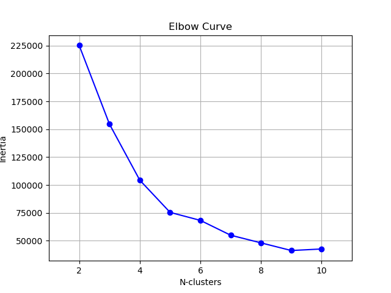

# Implementation of KMEAN clustering algorithm with Pandas and Numpy

Kmeans is a clustering algorithm that seeks to find natural groupings in unlabeled data.
This project seeks to mimic how the KMeans works in a naive approach.


# How it works

1. Cluster K number of centroids are initialized randomly from the data. K is the number of clusters you want to use.
2. The distance between each centriod and all the records in the dataframe is calculated. (Used Euclidean Distance).
3. Each datapoint is assigned to the cluster of it's nearest centroid.
4. New centriods are adjusted as the means of each cluster for all the variables in the data.
5. Steps 2-4 are repeated until the centroids can no longer change or the maximum number of iterations is reached.


# How to use it

```python
    kmeans = NaiveKMeans(df=dataframe, k=2)
    clusters = kmeans.predict()
    n_iterations = kmeans.n_iterations
    final_centroids = kmeans.centroids
```

The predict method returns the columns in the original dataframe together with the **clusters** column which is the cluster that each datapoint is assigned to.

### Selecting K best

* We use the Elbow curve to determine the optimal number of clusters in our data.
* First calculate inertia - inertia measures how far datapoints assigned to a cluster are from that clusters centroid.
* We want to get the fewest number of clusters that give the lowest inertia.

```python
    inertias = []
    for i in range(2, 11):
        km = NaiveKmeans(df, i)
        km.predict()
        inertia = km.inertia()
        inertias.append(inertia)
```

* Visualize the inertia and the number of cluster, where the elbow begins the form should be the optimal clusters.



* Sometimes in certain real world scenarios, the number of cluster could already be predefined.

# Limitations

* The algorithm is not optimized for large datasets.

# Contibutions

* Changes can be made to further improve the algorithm.
* Contributions are very much welcome.